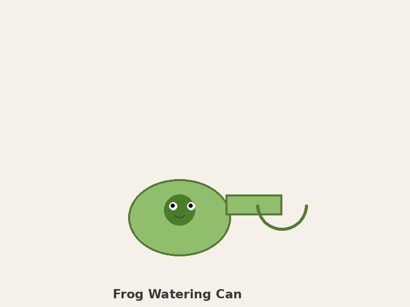
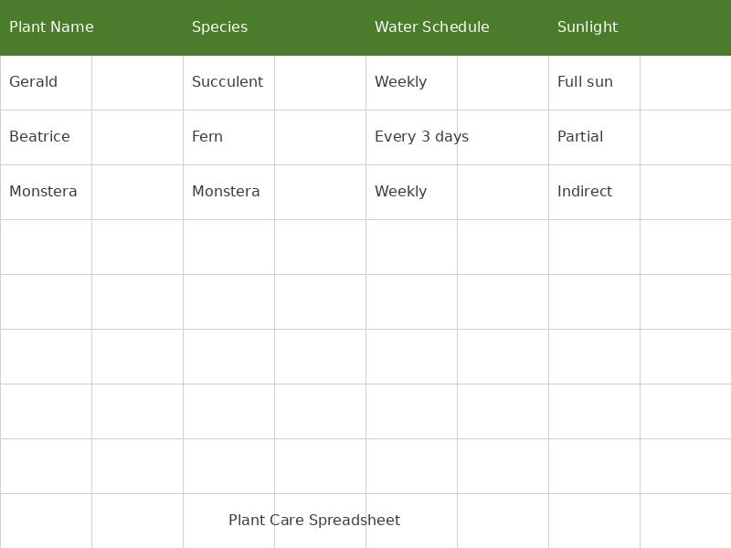

Went to Home Depot for lightbulbs. Left with lightbulbs and six plants. The cashier asked if I was starting a nursery. I said no, just have a lot of windowsills. She didn't look convinced.

{: .img-left .img-medium}
*The Home Depot Haul*

Friend came over, pointed at my growing collection and said, 'This is getting weird, Sam.' I disagreed while watering my twelfth plant. Bought a tiny watering can specifically for the job. It has a smiling frog on it.

{: .img-left .img-medium}
*Frog Watering Can*

Started a spreadsheet to track watering schedules. Color-coded by species and sunlight needs. Realized I had become the person I used to make fun of. Decided I was okay with this.

{: .img-left .img-medium}
*Plant Care Spreadsheet*
