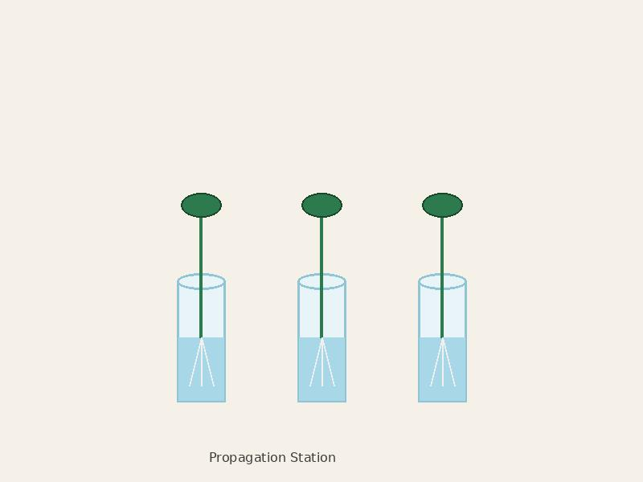
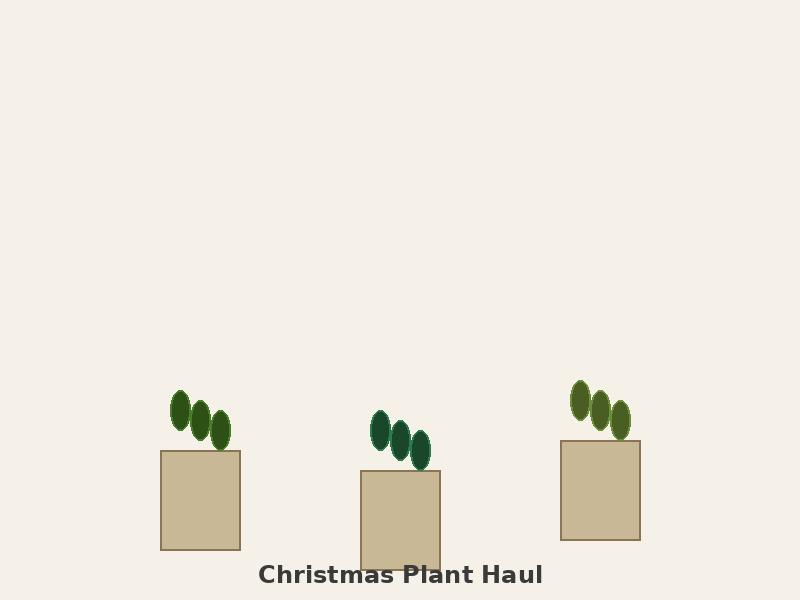

Valentine's Day. Bought myself a rare Philodendron. Cost more than any bouquet I've ever received. Worth it. Named her Valentine. She's thriving.

{: .img-left .img-medium}
*Valentine Philodendron*

Successfully propagated my first plant! Started with one cutting, now have three baby pothos. Gave them to friends. Am literally spreading plant parenthood. Mom says she's proud but concerned about my social life.

{: .img-left .img-medium}
*Propagation Station*

Family Christmas. Cousins asked what I wanted. Said 'rare houseplants' without irony. Received four plants. Best Christmas ever. Also received a t-shirt that says 'Caution: Crazy Plant Person.' Wore it immediately. Gerald approved from his place of honor on the mantle.

{: .img-left .img-medium}
*Christmas Plant Haul*

{: .img-right .img-medium}
*The Shirt*
