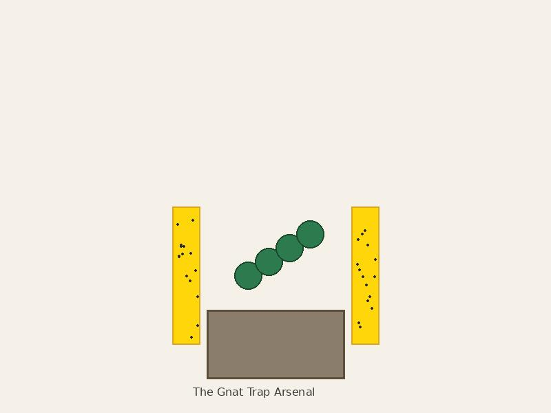

Noticed tiny flies near Beatrice. Googled it. Fungus gnats. Gross. Apparently I've been overwatering. Gerald and Beatrice's entire relationship was based on my ignorance of proper watering techniques.

Declared war on fungus gnats. Arsenal included: sticky traps, neem oil, diatomaceous earth, and one very angry determination. My apartment smelled like a neem oil factory. Roommate threatened to move out.

{: .img-left .img-medium}
*The Gnat Trap Arsenal*

Victory! The gnats are gone. Only lost one plant in the battle (RIP Fern #3, you were too beautiful for this world). Learned valuable lessons about drainage and not loving things to death.
